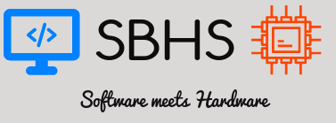

# SBHS Virtual Labs Server


 Please follow the steps below to set up the server code on your system:
 
 + Clone this repository.  
 `git clone https://github.com/codegeek96/SBHS-Vlabs.git`  
If you have permission issues, make sure that you are added as a collaborator.
Contact rupakrokade@gmail.com

+ Install **pip** and **virtualenv**. These two packages nedd to be installed globally on your system.  
+ Setup a virtualenv in your system.  
To check which is the default python in your system:  
`python --version`
  + If Python 2.7 is the default in your system, type the command
  `virtualenv venv`
  + If Python 3.x is the default in your system, type the command  
  `virtualenv venv --python=python2.7`
+ Activate the virtualenv with `source venv/bin/activate`
+ Go into the project directory and install the dependencies.
```bash
cd SBHS-Vlabs/
pip install -r requirements.txt
```

+ Create and run the database migrations using the following commands  
```bash
python manage.py makemigrations tables
python manage.py makemigrations yaksh
python manage.py makemigrations
python manage.py migrate
```

+ Run the server with `python manage.py` runserver. Open **localhost:8000** in your browser.
